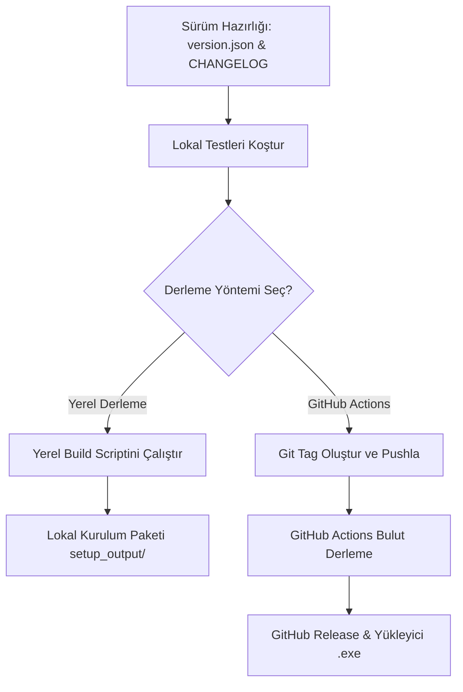

# RADPYS V3 — Dağıtım ve Sürüm Yönetim Rehberi

Bu rehber, **RADPYS V3** uygulamasını yerel bilgisayarınızda derlemek, temiz kopyalar oluşturmak, GitHub Actions aracılığıyla bulutta otomatik sürüm (Release) yayınlamak ve sürüm geçişlerinde yapılması gereken adımları detaylandırmaktadır.

---

## 🗺️ Genel Yol Haritası (Workflow)



---

## 1. Sürüm Öncesi Hazırlık Adımları (Her Sürümde Yapılacaklar)

Yeni bir EXE derlemeden veya GitHub'a yeni sürüm göndermeden önce mutlaka aşağıdaki dosyaları güncelleyin:

### A. Sürüm Numarasını Güncelleyin
[version.json](file:///c:/Users/HP/Desktop/cem/RADPYS_V3/version.json) dosyasını açarak yeni sürüm numarasını ve yayın tarihini yazın:
```json
{
  "version": "3.5.5",
  "release_date": "2026-07-24",
  "latest_demo_version": "3.5.5"
}
```
> [!IMPORTANT]
> Buradaki sürüm numarası, hem PyInstaller'ın ürettiği EXE'nin Windows özelliklerindeki dosya sürümüne (`version_info.txt` aracılığıyla) hem de Inno Setup yükleyicisinin adına otomatik olarak yansıtılır.

### B. CHANGELOG.md Dosyasını Güncelleyin
[CHANGELOG.md](file:///c:/Users/HP/Desktop/cem/RADPYS_V3/CHANGELOG.md) dosyasına yeni sürüm başlığını ve yapılan değişiklikleri ekleyin. GitHub Actions otomatik sürüm notlarını bu dosyadaki ilgili sürüm başlığının altından çeker:
```markdown
## [3.5.5] - 2026-07-24
### Eklendi
- Yeni sürüm yayınlama rehberi oluşturuldu.
### Düzeltildi
- Dağıtım öncesi boş veritabanının demo modda açılmasını engelleyen yapılandırma hatası düzeltildi.
```

### C. UI Arayüz Tasarımlarını Derleyin
Eğer Qt Designer ile `.ui` dosyalarında değişiklik yaptıysanız, bu tasarımların Python koduna dönüştürülmesi için derleme öncesinde mutlaka şu betiği çalıştırın:
```powershell
python scripts/compile_ui.py
```
> [!IMPORTANT]
> `build_dist.py` yerel derleme betiği arayüz tasarımlarını otomatik olarak derlemez. Yapılan tasarım güncellemelerinin EXE'de görünmesi için derleme öncesi bu adımı çalıştırmalısınız.

### D. Windows Sürüm Bilgilerini Güncelleyin (version_info.txt)
Derlenen `.exe` dosyasının Windows dosya özelliklerinde (Ayrıntılar sekmesinde) doğru sürüm numarasını göstermesi için [version_info.txt](file:///c:/Users/HP/Desktop/cem/RADPYS_V3/version_info.txt) dosyasını açıp aşağıdaki satırları yeni sürümünüze göre güncelleyin:
*   `filevers=(3, 5, 5, 0)` ve `prodvers=(3, 5, 5, 0)`
*   `StringStruct('FileVersion', '3.5.5.0')`
*   `StringStruct('ProductVersion', '3.5.5.0')`

### E. Lokal Testleri Koşturun
Uygulamayı derlemeden önce kod kalitesini doğrulamak için PowerShell terminalinde testleri koşturun:
```powershell
python -m pytest tests/ --tb=short -q
```
> [!TIP]
> Sadece belirli bir modülü test etmek isterseniz (örneğin lisans modülü):
> `python -m pytest tests/test_license_service.py --tb=short -q`

---

## 2. Yöntem A: GitHub Actions ile Otomatik Sürüm Yayınlama (Önerilen)

GitHub üzerinde kurduğumuz otomatik altyapı sayesinde, yerel bilgisayarınızda hiçbir derleme aracı (PyInstaller, Inno Setup vb.) kurulu olmasa bile temiz bir EXE kurulum paketi oluşturabilirsiniz.

### Adım 1: Kodları GitHub'a Gönderin
Yaptığınız tüm değişiklikleri kaydedin ve GitHub ana dalına (`main` veya `master`) pushlayın:
```powershell
git add .
git commit -m "bump: v3.5.5 sürüm hazırlığı"
git push origin main
```

### Adım 2: Sürüm Etiketi (Tag) Ekleyin ve Gönderin
Sürüm numaranızla birebir eşleşen bir git etiketi oluşturup GitHub'a pushlayın:
```powershell
git tag v3.5.5
git push origin v3.5.5
```

### Adım 3: Süreci Takip Edin ve İndirin
1. GitHub reponuzda **Actions** sekmesine gidin.
2. **Build & Release** workflow'unun başladığını göreceksiniz (Derleme yaklaşık 3-5 dakika sürer).
3. Derleme bittiğinde, reponuzun **Releases** kısmında otomatik olarak yeni sürüm oluşturulmuş ve kurulum paketi (`RADPYS_Setup_v3.5.5.exe`) buraya yüklenmiş olacaktır.

---

## 3. Yöntem B: Yerel Bilgisayarda EXE Derleme (Local Build)

Eğer GitHub Actions kullanmadan, doğrudan kendi bilgisayarınızda yerel testler yapmak için EXE üretmek istiyorsanız aşağıdaki adımları takip edin:

### Adım 1: Gerekli Kütüphaneleri ve Derleme Araçlarını Kurun
Terminalinizde sanal ortamın (`.venv`) aktif olduğundan emin olun, önce proje gereksinimlerini ardından derleme araçlarını yükleyin:
```powershell
# Proje bağımlılıklarını yükleyin
pip install -r requirements.txt

# Derleme araçlarını yükleyin
pip install pyinstaller pillow
```
*Not: Inno Setup 6'nın bilgisayarınızda kurulu olması gerekmektedir (Kurulu değilse sadece PyInstaller çalıştırılır ve kurulum paketi adımı atlanır).*

### Adım 2: Temiz Kopyayı Hazırlayın (Opsiyonel)
Derleme öncesi temiz bir kaynak kod üzerinde çalışmak isterseniz, az önce hazırladığımız [exe](file:///c:/Users/HP/Desktop/cem/RADPYS_V3/exe) klasörünü kullanabilir veya yerel dizinde derlemeyi tetikleyebilirsiniz.

### Adım 3: Derleme Scriptini Çalıştırın
Proje kök dizininde veya temiz `exe/` klasörü içinde şu komutu çalıştırarak derlemeyi başlatın:
```powershell
# Temizleyip sıfırdan derlemek için:
python scripts/build_dist.py --clean

# Sadece PyInstaller derlemesi yapmak (Inno Setup paketini atlamak) için:
python scripts/build_dist.py --no-inno
```

### Adım 4: Çıktıları Kontrol Edin
Derleme tamamlandıktan sonra oluşturulan çıktılar şu dizinlerde yer alacaktır:
*   **PyInstaller Klasör Çıktısı:** `dist/RADPYS/` (Taşınabilir klasör sürümü)
*   **Inno Setup Kurulum EXE'si:** `setup_output/RADPYS_Setup_v3.5.5.exe` (Tek dosya kurulum paketi)

---

## ⚠️ Kritik Dikkat Edilmesi Gerekenler (Pitfalls)

> [!WARNING]
> **Özel Lisans Anahtarları (Private Key):**
> [lisans](file:///c:/Users/HP/Desktop/cem/RADPYS_V3/lisans) klasörü altındaki `license_private_key.pem` özel anahtarı ve `license_generator_gui.py` gibi araçlar **kesinlikle** son kullanıcıya dağıtılacak temiz kopyada veya derlenmiş EXE klasöründe bulunmamalıdır. Temiz kopyadan bu klasörleri otomatik olarak arındırdık, ancak manuel dosya eklemeleri yaparken bu kuralı unutmayın.

> [!IMPORTANT]
> **Demo Mod Koruması:**
> Dağıtılacak olan `radpys.db` boş veritabanında `demo_mode` meta verisi otomatik olarak `"1"` olarak tohumlanır. Bu sayede son kullanıcı yazılımı kurduğunda lisans girene kadar 15 personel ve 3 nöbet planı limiti ile çalışır. Yerel geliştirme veritabanınızda ise testlerin aksamaması için varsayılan olarak demo mod kapalı kalır.

> [!CAUTION]
> **Veritabanı Ezilme Koruması:**
> `radpys_installer.iss` dosyasında `dist_data\data\*` kopyalanırken `onlyifdoesntexist` bayrağı kullanılmıştır. Bu sayede son kullanıcı programı güncellediğinde eski veritabanı (kayıtlı personeller, lisans vb.) kesinlikle silinmez veya ezilmez. Yeni tablolar ve schema değişiklikleri `MigrationRunner` tarafından otomatik olarak uygulanır.
